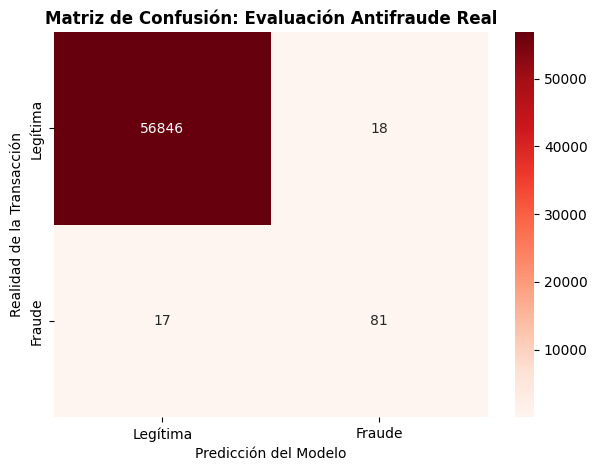

# deteccion-fraude-bancario-ml.
# Detección de Fraude con Tarjetas de Crédito 
fraud-detection-banking-ml/
│
├── data/
│   └── .gitkeep                 # (El dataset creditcard.csv no se sube por peso, se indica el link)
├── notebooks/
│   ├── 01_EDA_and_Data_Cleaning.ipynb
│   └── 02_Model_Training_and_Threshold_Tuning.ipynb
├── .gitignore                   # Para ignorar creditcard.csv y archivos temporales
├── requirements.txt             # pandas, numpy, scikit-learn, matplotlib, seaborn
└── README.md                    # Documentación ejecutiva del proyecto

